# Diagram Architektury: System Autentykacji pAIn-less

Ten diagram przedstawia kompletną architekturę systemu autentykacji zgodną ze specyfikacją z pliku `auth-spec.md` oraz wymaganiami US-006 z dokumentu PRD.

## Architektura systemu autentykacji

```mermaid
graph TB
    %% User Interface Layer
    subgraph "Frontend - Astro 5 + React 19"
        UserBrowser["👤 User Browser"]
        
        subgraph "Pages (Astro SSR)"
            IndexPage["/index.astro<br/>Landing Page"]
            CalendarPage["/calendar.astro<br/>Protected"]
            LoginPage["/auth/login.astro<br/>New"]
            RegisterPage["/auth/register.astro<br/>New"]
            ForgotPage["/auth/forgot-password.astro<br/>New"]
            ResetPage["/auth/reset-password.astro<br/>New"]
        end
        
        subgraph "Layouts"
            MainLayout["MainLayout.astro<br/>Current + Auth Integration"]
            AuthLayout["AuthLayout.astro<br/>New - Minimal UI"]
        end
        
        subgraph "React Components"
            NavBar["NavigationBar.tsx<br/>Auth State Integration"]
            LoginForm["LoginForm.tsx<br/>New"]
            RegisterForm["RegisterForm.tsx<br/>New"]
            ForgotForm["ForgotPasswordForm.tsx<br/>New"]
            ResetForm["ResetPasswordForm.tsx<br/>New"]
            AuthCard["AuthCard.tsx<br/>New"]
        end
    end

    %% Middleware Layer
    subgraph "Middleware Layer"
        AstroMiddleware["Astro Middleware<br/>src/middleware/index.ts<br/>Enhanced"]
        AuthMiddleware["Auth Functions<br/>src/middleware/auth.ts<br/>Replaced POC"]
        RouteGuards["Route Protection<br/>Protected Routes Check"]
    end

    %% API Layer
    subgraph "API Layer"
        subgraph "Auth Endpoints (New)"
            LoginAPI["/api/auth/login<br/>POST"]
            RegisterAPI["/api/auth/register<br/>POST"]
            LogoutAPI["/api/auth/logout<br/>POST"]
            ForgotAPI["/api/auth/forgot-password<br/>POST"]
            ResetAPI["/api/auth/reset-password<br/>POST"]
            VerifyAPI["/api/auth/verify-email<br/>GET"]
            MeAPI["/api/auth/me<br/>GET"]
        end
        
        subgraph "Protected Endpoints (Current)"
            HealthAPI["/api/health-profiles/*<br/>requireAuth()"]
            SupplementsAPI["/api/supplements/*<br/>requireAuth()"]
            AlertsAPI["/api/health-alerts/*<br/>requireAuth()"]
            UserSupplementsAPI["/api/user-supplements/*<br/>requireAuth()"]
        end
    end

    %% Service Layer
    subgraph "Service Layer"
        AuthService["AuthService<br/>src/lib/auth/auth-service.ts<br/>New"]
        SessionService["Session Management<br/>src/lib/auth/session.ts<br/>New"]
        ValidationService["Validation Schemas<br/>src/lib/auth/validation.ts<br/>New"]
        ErrorService["Auth Error Handling<br/>src/lib/auth/errors.ts<br/>New"]
    end

    %% Backend Services
    subgraph "Backend Infrastructure"
        SupabaseAuth["Supabase Auth<br/>Email/Password<br/>Session Management"]
        SupabaseDB["Supabase DB<br/>PostgreSQL<br/>User Data"]
        EmailService["Email Service<br/>Verification<br/>Password Reset"]
    end

    %% Data Flow - Authentication
    UserBrowser --> LoginPage
    UserBrowser --> RegisterPage
    UserBrowser --> ForgotPage
    UserBrowser --> ResetPage
    
    LoginPage --> LoginForm
    RegisterPage --> RegisterForm
    ForgotPage --> ForgotForm
    ResetPage --> ResetForm
    
    LoginForm --> LoginAPI
    RegisterForm --> RegisterAPI
    ForgotForm --> ForgotAPI
    ResetForm --> ResetAPI
    
    LoginAPI --> AuthService
    RegisterAPI --> AuthService
    ForgotAPI --> AuthService
    ResetAPI --> AuthService
    LogoutAPI --> AuthService
    
    AuthService --> SupabaseAuth
    SupabaseAuth --> SupabaseDB
    SupabaseAuth --> EmailService
    
    %% Session Management
    AuthService --> SessionService
    SessionService --> AstroMiddleware
    
    %% Route Protection
    AstroMiddleware --> RouteGuards
    RouteGuards --> AuthMiddleware
    AuthMiddleware --> SessionService
    
    %% Protected Pages Access
    UserBrowser --> CalendarPage
    CalendarPage --> RouteGuards
    RouteGuards -.->|"Not Authenticated"| LoginPage
    RouteGuards -->|"Authenticated"| CalendarPage
    
    %% Navigation Integration
    MainLayout --> NavBar
    NavBar --> LogoutAPI
    AuthLayout --> AuthCard
    
    %% API Protection
    RouteGuards --> HealthAPI
    RouteGuards --> SupplementsAPI
    RouteGuards --> AlertsAPI
    RouteGuards --> UserSupplementsAPI
    
    %% Error Handling
    AuthService --> ErrorService
    ValidationService --> ErrorService
    
    %% Validation
    LoginForm --> ValidationService
    RegisterForm --> ValidationService
    LoginAPI --> ValidationService
    RegisterAPI --> ValidationService

    %% Styling
    classDef newComponent fill:#e1f5fe
    classDef existingComponent fill:#f3e5f5
    classDef protectedRoute fill:#ffecb3
    classDef authFlow fill:#c8e6c9
    
    class LoginPage,RegisterPage,ForgotPage,ResetPage,AuthLayout,LoginForm,RegisterForm,ForgotForm,ResetForm,AuthCard,LoginAPI,RegisterAPI,LogoutAPI,ForgotAPI,ResetAPI,VerifyAPI,MeAPI,AuthService,SessionService,ValidationService,ErrorService newComponent
    
    class IndexPage,CalendarPage,MainLayout,NavBar,HealthAPI,SupplementsAPI,AlertsAPI,UserSupplementsAPI,AstroMiddleware existingComponent
    
    class RouteGuards,AuthMiddleware protectedRoute
    
    class SupabaseAuth,SupabaseDB,EmailService authFlow
```



## Legenda kolorów

- **🔵 Niebieskie (newComponent)**: Nowe komponenty do implementacji
- **🟣 Fioletowe (existingComponent)**: Istniejące komponenty do modyfikacji  
- **🟡 Żółte (protectedRoute)**: Mechanizmy ochrony tras
- **🟢 Zielone (authFlow)**: Infrastruktura backend (Supabase)

## Kluczowe przepływy

### 1. Przepływ rejestracji
```
User → RegisterPage → RegisterForm → RegisterAPI → AuthService → Supabase Auth → Email Service
```

### 2. Przepływ logowania
```
User → LoginPage → LoginForm → LoginAPI → AuthService → Supabase Auth → SessionService → AstroMiddleware
```

### 3. Ochrona tras
```
User → Protected Page → RouteGuards → AuthMiddleware → SessionService → Allow/Redirect to Login
```

### 4. Wylogowanie
```
User → NavBar → LogoutAPI → AuthService → Supabase Auth → SessionService → Clear Session
```

## Zgodność z wymaganiami

✅ **US-006 - Bezpieczny dostęp:**
- Dedykowane strony logowania i rejestracji
- Przycisk logowania/wylogowania w prawym górnym rogu (NavBar)
- Brak zewnętrznych dostawców autentykacji
- Funkcjonalność odzyskiwania hasła
- Ochrona wszystkich funkcji przed nieautoryzowanym dostępem

✅ **Kompatybilność z istniejącą architekturą:**
- Wykorzystanie obecnego systemu middleware
- Integracja z istniejącymi layoutami i komponentami
- Zachowanie obecnych endpointów API z dodaniem ochrony
- Zgodność z stack technologicznym (Astro 5, React 19, Supabase)

✅ **Architektura zgodna z projektem:**
- Server-side rendering z Astro
- Interaktywne komponenty w React
- TypeScript dla bezpieczeństwa typów
- Tailwind + Shadcn/ui dla spójnego UI 